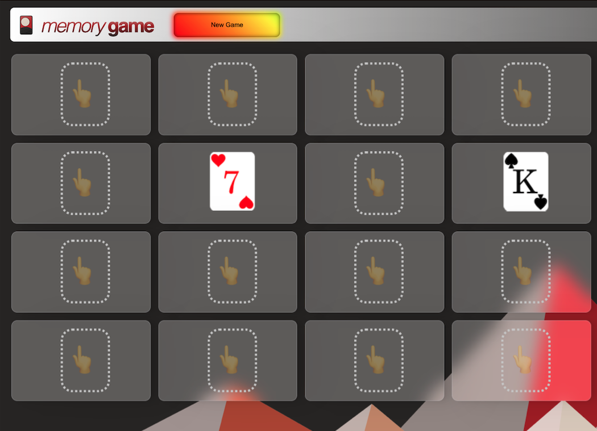
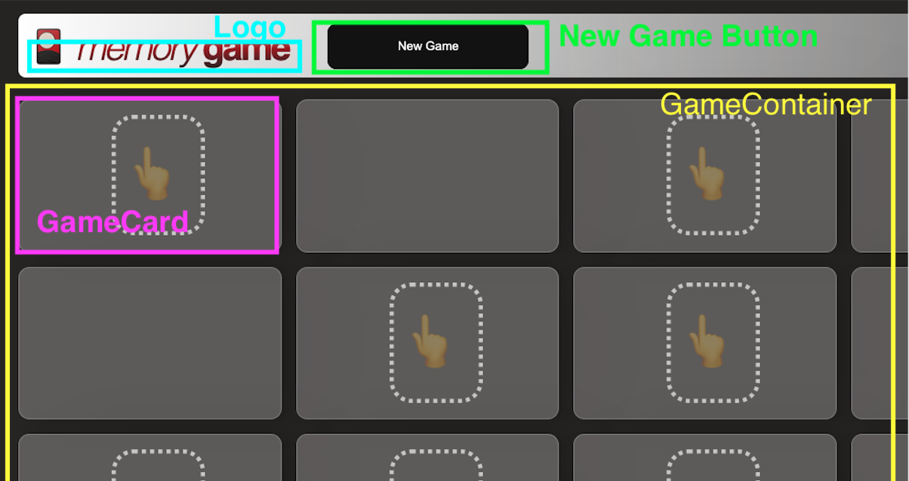

# 🎴 Memory Game! — Guaranteed Rate (rate.com)

Take-home test by [Karl Golka](https://karlgolka.com) / contact@karlgolka.com done on `Sep 21-22, 2021`.


## 💡 Lighthouse Results


## 📸 Screenshot

 


Upon winning (**confetti**):


## 🚥 Status

* ✅ URL: **https://rate-test-karlgolka.vercel.app/** (Vercel URL)


## 🏥 Debugging Help 

* NOTE: easy help mode can be displayed by appending **`&help=on`** to the end of any game URL


## 👍 Overview 

This is a full-stack **serverless** React Next.js application (built for [Rate.com](https://Rate.com/)'s take home test) by [Karl Golka](https://karlgolka.com/) on Sept 21-22, 2021 that uses:

- [nx](https://nx.dev/) (monorepo)


The **front-end** is built with:

* **React** (hooks, Typescript, Next.js)
* **GraphQL** ([urql](https://formidable.com/open-source/urql/), [GraphQL Code Generator](https://www.graphql-code-generator.com/), @urql/exchange-graphcache)


And the **back-end** is built with:

* [Terraform](https://terraform.io) (Terraform Cloud)
* **AWS AppSync, DynamoDB**, & CloudWatch, & IAM
* Cloud Native [VTL templates](https://docs.aws.amazon.com/appsync/latest/devguide/resolver-mapping-template-reference-programming-guide.html)


## ✅ Requirements

Before starting 🏁, you need to have these installed on your machine:

* [Git](https://git-scm.com/) 
* [Node](https://nodejs.org/en/) 
* and [yarn](https://classic.yarnpkg.com/en/docs/install)  


## 👨🏻‍💻 How to Install

```sh
# clone the repo
git clone https://github.com/charlieargue/rate-test-karlgolka

# change directory 
cd rate-test-karlgolka

# install libraries (this can take a few minutes)
yarn

# create local environment file
touch apps/rate-test-karlgolka-fe/.env.local

# edit its values to these:
NEXT_PUBLIC_API_URL=https://ubgtwkg2frayfhzdgiwr6uj2iq.appsync-api.us-west-2.amazonaws.com/graphql
NEXT_PUBLIC_API_KEY=da2-hhprl2gth5hzzmyhm2ewifiit4
```


## ⚡️ Starting the Front-End locally:

You can start the local web development server and fire up the front-end with:

```sh
yarn start		
```

You can view the site at:

* ✅  **http://localhost:4200/**


## 🗂 nx Project Overview

This nx monorepo contains the following projects:

### `/apps`

* **rate-test-karlgolka-fe**: main Next.js web application

###  `/libs`

* **react-data-access**: 
  * the automatically-generated code from GraphQL Code Generator (strongly-typed custom mutation/query hooks, etc.);
  * it also contains all the GraphQL **documents** for fragments, input types, and queries/mutations used by the front-end (and which power the code generator)
  * urql customizations and cache updates (not needed in this project)
* **iac**: 
  * all the back-end Infrastructure-as-Code (IAC) "code" 
  * Terraform configuration
  * AppSync pipeline functions, resolvers, and mapping templates (`.VTL`)
  * the GraphQL schema
  * necessary roles and policies


# 🌲 React Component Heirarchy



 

## ⛅️ CICD Workflows

⚠️ Note: these are extremely simple and intended only for demonstration purposes (not team- or production-ready workflows, no branching strategries)


#### The CICD workflows for the **Front-End** are:

* **Local GIT commits** ➡ trigger <u>Vercel</u> builds and deployments to `main` branch


#### The CICD workflows for the **Back-End** are:

* **Local GIT commits** ➡ trigger <u>Terraform Cloud</u> auto-applies for `production` workspace


## ✉️ Contact Me

My personal website is https://karlgolka.com/ and you can email me at contact@karlgolka.com 


## 📝 License

[MIT](https://github.com/charlieargue/rate-test-karlgolka/blob/develop/LICENSE)

